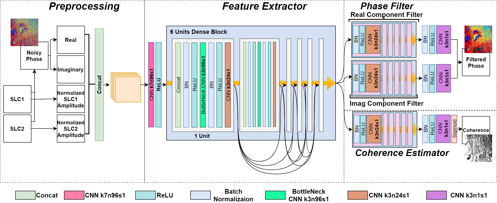

# DeepInSAR
The code for our proposed DeepInSAR: A Deep Learning Framework for SAR Interferometric Phase Restoration and Coherence Estimation

It includes both Tensorflow and PyTorch implementaions.

## Usage
1. Clone this repo
```
git clone https://github.com/Lucklyric/DeepInSAR/
```
2. Clone our InSAR-Simualtor (DeepInSAR branch). Welcome to try our other verions with new features.
```
git clone https://github.com/Lucklyric/InSAR-Simulator
git checkout DeepInSAR-v1
```
3. Insatll all python dependencies. You can find conda and pip dependencies under each implementations `dependencies` folder
4. Run training process using `run.sh` with correspodning `SIM_DB_ROOT`

## Architecture


## Extra
Implementations of BoxCar, NL-SAR, NL-InSAR can be found at: https://github.com/gbaier/despeckCL
